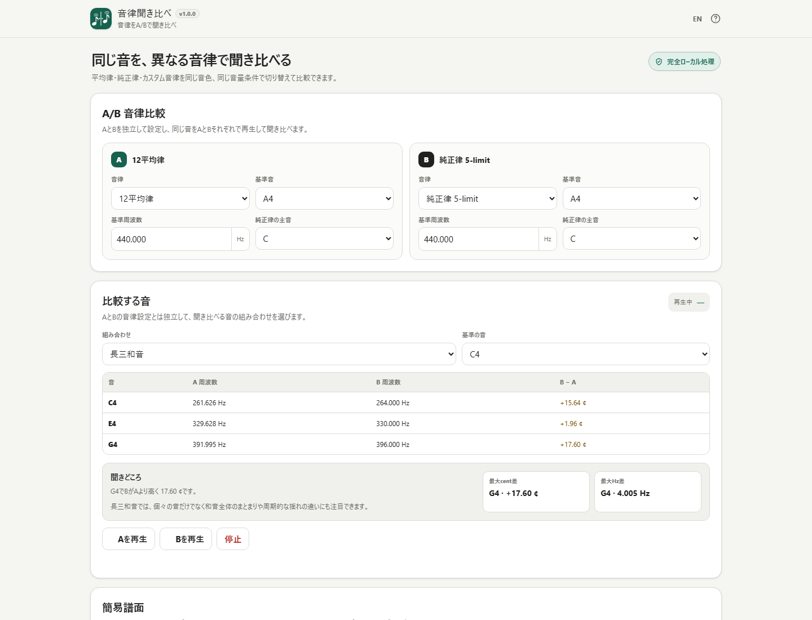
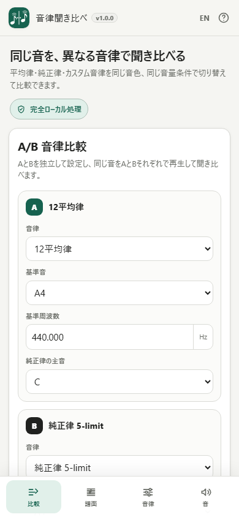

# 音律聞き比べ / Tuning Compare

[](https://github.com/ttomohisa/htmlapps-tuning-compare/actions/workflows/build-standalone.yml)
[](LICENSE)
[](https://ttomohisa.github.io/htmlapps-tuning-compare/)
[](CHANGELOG.md)

[English README](README.md)

**12平均律・5-limit純正律・カスタム音律を、同じ音・同じ音色・同じ音量条件で聞き比べるためのブラウザアプリです。**

耳で違いを確かめながら周波数やcent差を確認し、1〜16小節の簡易譜面を編集したり、カスタム音律の周波数を直接調整したり、結果をWAVとして保存できます。

譜面、音律設定、生成した音声をアプリから外部サーバーへ送信せず、ブラウザ内で処理します。

## 🚀 デモ

### [GitHub Pagesで音律聞き比べを開く](https://ttomohisa.github.io/htmlapps-tuning-compare/)

GitHub Pagesから最初のHTMLを読み込んだ後、音律計算、譜面編集、再生、WAV生成、プロジェクトJSONはブラウザ内で処理します。譜面や音律設定、生成した音声をアプリから外部へ送信しません。

[](https://ttomohisa.github.io/htmlapps-tuning-compare/)

## 主な機能

- **同じ条件で音律A / Bを比較** — 同じ音・同じ音色・同じ音量条件でAとBを再生し、音程の違いを聞き比べられます。
- **12平均律と5-limit純正律** — 基準音・基準周波数を指定し、純正律ではプリセットの比率を使う主音も選べます。
- **カスタム音律を直接編集** — Hz・比率・cent差で値を変更し、1音ずつ試聴しながら調整できます。
- **数値でも違いを確認** — A/Bそれぞれの周波数とcent差を、聞き比べと一緒に確認できます。
- **1〜16小節の簡易譜面** — 初期状態は4小節で、必要に応じて小節を増減できます。単音・和音・休符・臨時記号、3/4・4/4、全音符・2分音符・4分音符・8分音符・16分音符に対応します。
- **五線譜上で編集** — 和音は長押しで複製、左右ドラッグでは構成音の高さを保ったまま移動できます。休符も左右移動でき、選択中の和音では縦のガイドから狙った高さへ音を追加できます。音価の切り替えは**次に入力する音符・休符だけ**に適用し、選択中の既存音符の長さは変えません。
- **比較しやすいサンプル** — 長三度、長三和音、Cメジャースケール、I–IV–V–Iを読み込めます。
- **WAVを端末内で生成** — Aのみ、Bのみ、A → B比較を44.1 kHz / 48 kHz・16-bit mono WAVで保存できます。
- **実験条件をJSONで保存** — 譜面、音律、音色、WAV設定などをプロジェクトJSONとして書き出し・読み込みできます。
- **ローカル処理の単一HTML** — 日本語 / 英語UI、端末内自動保存、実行時CDNなし、外部ランタイム通信なしで動作します。

## すぐに使う

インストールやアカウント登録は不要です。

### Webで使う

[GitHub Pages版を開く](https://ttomohisa.github.io/htmlapps-tuning-compare/)だけで利用できます。

### 単一HTMLをダウンロードして使う

1. このリポジトリの [tuning-compare.html](tuning-compare.html) をダウンロードします。
2. 現行ブラウザで直接開きます。
3. 初期状態の「A = 12平均律」「B = 5-limit純正律」をそのまま聞くか、再生前にA/Bの設定を変更します。

`tuning-compare.html` には、実行時に必要なアプリ本体・UI・翻訳・プリセット・アイコンが含まれています。

### 自分でビルドする

1. このリポジトリをダウンロードまたはクローンします。
2. 次を実行します。

```powershell
pwsh -NoProfile -File .\build-standalone.ps1
```

3. 生成された `dist/index.html` を直接開きます。

CSPや単一HTML構成まで含めてリポジトリ全体を検証する場合：

```powershell
powershell.exe -NoLogo -NoProfile -ExecutionPolicy Bypass -File .\scripts\check-powershell-syntax.ps1
pwsh -NoProfile -File .\scripts\check-repository.ps1
```

## 使い方

### 1. 音律Aと音律Bを設定する

A/Bそれぞれで次を選べます。

- 12平均律
- 5-limit純正律
- カスタム音律

基準音と基準周波数は音律ごとに保持します。純正律では、プリセットの周波数比を計算する基準となる主音も選びます。

### 2. 比較する音を選ぶ

長三度、完全五度、長三和音から組み合わせを選び、基準となる音を指定します。

**Aを再生** / **Bを再生** で同じ音をそれぞれの音律で鳴らせます。比較表にはA/Bの周波数とcent差が表示されます。

### 3. 簡易譜面を編集する

譜面は初期状態4小節で、1〜16小節まで増減できます。本格的な楽譜制作ソフトにはしていません。

v1.0.0で扱えるもの：

- ト音記号
- 1〜16小節（− / ＋で増減）
- 単音・和音
- 休符
- 全音符・2分音符・4分音符・8分音符・16分音符
- ♭ / ♮ / ♯
- 4/4・3/4
- 30〜300 BPM
- 単音のドラッグによる音高・開始位置の変更
- 和音の横ドラッグ（構成音の高さを固定）
- 和音の長押し複製
- 選択中の和音へ音を追加しやすい縦ガイド
- 休符の横ドラッグ
- 入力音価の変更は次に入力する音符・休符だけに適用
- 同じ五線位置の♭ / ♮ / ♯は別音追加ではなく、その位置の臨時記号を置き換え
- Undo / Redo

PCでは1段2小節、スマートフォンでは1段1小節に折り返し、長い横スクロールを避けます。

### 4. 音律の数値を確認・編集する

音律表では、各音の周波数や関連する値を確認できます。

カスタム音律では次の3方式で編集できます。

- Hz
- 比率
- cent差

カスタム音律はC4〜B4を直接保持し、ほかのオクターブは2:1で生成します。

### 5. WAVを書き出す

譜面をブラウザ内でレンダリングし、次の形式で保存できます。

- Aのみ
- Bのみ
- A → B比較

WAVは44.1 kHzまたは48 kHz、16-bit mono PCMです。

A/Bを公平に比較するため、AとBには同じ音色・ゲイン条件を使用し、A/Bを別々に最大音量へ正規化しません。

### 6. プロジェクトを保存・復元する

プロジェクトJSONには、譜面や音律設定など編集可能な状態を保存します。音声データそのものはJSONへ含めません。

現在の状態はブラウザ内にも自動保存されます。ブラウザのサイトデータを削除した場合は、保存状態も消えることがあります。

## スマートフォンUI

スマートフォン版はPC画面をそのまま縮小した構成ではありません。

下部ナビゲーションから、

- 比較
- 譜面
- 音律
- 音

を切り替えます。

譜面は小節単位で折り返し、必要なタップ領域を確保します。「譜面」タブでは、**音符 / 休符**、**音価**、**♭ / ♮ / ♯** のクイック操作バーを下部ナビゲーションのすぐ上に固定表示します。音符や和音を選択すると **「＋3度下」「＋3度上」** をワンタップで追加できるため、スマホでも和音を作りやすくしています。サンプル譜面は初期状態では閉じています。



## GitHub Pagesで公開する

このリポジトリには、単一HTMLをビルドして、GitHub Pagesが有効な場合に `dist` を公開するワークフローが含まれています。

1. **Settings → Pages** を開きます。
2. **Build and deployment → Source** で **GitHub Actions** を選択します。
3. `main` へプッシュするか、Actionsから **Deploy standalone app to GitHub Pages** を手動実行します。
4. 公開前に単一HTMLの再生成と検証が実行されます。

GitHub Pagesがまだ有効になっていない場合でも、アプリのビルドと検証までは実行し、デプロイだけをスキップしてworkflow summaryへ設定手順を表示します。

## 開発とビルド構成

```text
.
├─ src/index.template.html          # アプリ本体のテンプレート
├─ app.config.json                  # アプリ情報・ビルド設定
├─ assets/
│  ├─ favicon.svg                   # favicon / ヘッダー共通アイコン
│  ├─ screenshot.png                # 日本語PCスクリーンショット
│  ├─ screenshot-en.png             # 英語PCスクリーンショット
│  └─ screenshot-mobile.png         # 日本語スマホスクリーンショット
├─ build-standalone.ps1             # 単一HTMLビルダー
├─ scripts/check-repository.ps1     # リポジトリ・回帰検証
├─ scripts/verify-standalone.ps1    # 単一HTML / CSP / 通信検証
├─ tuning-compare.html              # 生成済みの配布用単一HTML
├─ dist/index.html                  # ビルドで生成する単一HTML
└─ .github/workflows/
   ├─ build-standalone.yml          # Pull Request時の単一HTML検証
   └─ deploy-pages.yml              # GitHub Pages公開
```

編集元は `src/index.template.html` です。生成済みHTMLを直接編集しません。

ビルド処理では次を行います。

- `app.config.json` のアプリ情報を反映
- favicon / ヘッダーアイコンを同じSVGから内包
- `dist/index.html` を生成
- リポジトリ設定に従ってSelf-extract版も生成
- 読みやすい単一HTMLを `tuning-compare.html` にコピー
- 未置換のビルドプレースホルダーを検査
- faviconと左上アプリアイコンが同一SVGであることを検査
- ローカル処理用CSPを検査
- ビルド・依存関係マニフェストを生成

## プライバシーと外部通信

音律聞き比べでは、譜面、音律設定、プロジェクトJSON、生成したWAVを端末内で処理します。

単一HTML版は次を満たすよう検証しています。

- Content Security Policyに `connect-src 'none'`
- 外部ランタイムscript URLなし
- 外部ランタイムstylesheet URLなし
- 実行時CDN依存なし
- 主要機能にtelemetryや外部APIを不要とする構成

GitHub Pagesなどの静的ホスティングで利用する場合、ページを開くための最初のHTML取得は発生します。その後、音律設定や生成音声をアプリから外部へ送信する処理はありません。

ネットワークを切った状態で使う場合は、生成済みの単一HTMLを直接開き、詳細は [VERIFY_OFFLINE.md](VERIFY_OFFLINE.md) を確認してください。

## 制限事項

- 本アプリは音律比較ツールであり、本格的な楽譜制作ソフト、DAW、MIDIシーケンサーではありません。
- 譜面は1〜16小節に対応し、初期状態は4小節です。
- 付点音符、タイ、連符、強弱記号、複数パートには対応していません。
- MIDIキーボード入力、MIDIファイル読み込みには対応していません。
- カスタム音律はC4〜B4を直接保持し、ほかのオクターブを2:1で生成します。オクターブごとの独立周波数指定には対応していません。
- 内蔵の純正律は、選択した主音を基準とする5-limit純正律プリセットです。「すべての調・すべての和音が常に完全な純正になる」という意味ではありません。
- WAVは16-bit mono PCMです。24-bit WAV、FLACなどの追加形式には対応していません。
- 実際に聞こえる範囲や再生品質は、ブラウザ、端末の音声処理、スピーカー / ヘッドホン、利用者によって異なります。
- 主対象はChrome / Edgeです。Safari / Firefoxは必要なWeb Audio APIが利用できる範囲で対応します。

## 使用ライブラリ

`dependencies.json` に登録された**サードパーティの実行時依存はありません**。

HTML、CSS、JavaScript、SVG、Web Audio APIなどブラウザ標準機能で実装しています。リポジトリ上の表記については [THIRD_PARTY_NOTICES.md](THIRD_PARTY_NOTICES.md) を確認してください。

## コントリビューション

バグ報告や機能提案はGitHub Issuesからお願いします。開発ルールは [CONTRIBUTING.md](CONTRIBUTING.md) を確認してください。

## ライセンス

Copyright © 2026 ttomohisa

このプロジェクトは [MIT License](LICENSE) で公開されています。
