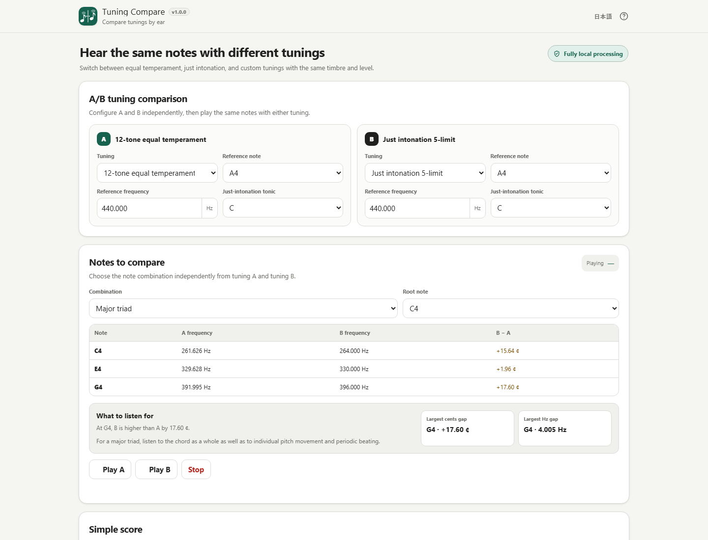

# Tuning Compare / 音律聞き比べ

[](https://github.com/ttomohisa/htmlapps-tuning-compare/actions/workflows/build-standalone.yml)
[](LICENSE)
[](https://ttomohisa.github.io/htmlapps-tuning-compare/)
[](CHANGELOG.md)

[日本語版 README](README.ja.md)

A browser-based tool for comparing **12-tone equal temperament**, **5-limit just intonation**, and **custom tunings** with the same notes, timbre, and playback level.

You can compare tunings by ear, inspect frequencies and cents differences, edit a compact 1–16 measure score, adjust custom frequencies directly, and export the result as WAV — without uploading the score, tuning settings, or generated audio.

## 🚀 Live demo

### [Open Tuning Compare on GitHub Pages](https://ttomohisa.github.io/htmlapps-tuning-compare/)

GitHub Pages serves the initial HTML. After it loads, tuning calculations, score editing, playback, WAV rendering, and project JSON are handled locally in the browser. The app does not upload the score, tuning settings, or generated audio.

[](https://ttomohisa.github.io/htmlapps-tuning-compare/)

## Features

- **Compare tuning A and B under the same conditions** — Play the same notes with the same timbre and level so pitch differences are easier to hear.
- **12-tone equal temperament and 5-limit just intonation** — Select the reference pitch and, for just intonation, the tonic used by the built-in ratio table.
- **Edit custom tunings directly** — Work in Hz, ratio, or cents and audition individual notes while adjusting them.
- **See the difference numerically** — Inspect A/B frequency values and cents differences alongside the listening comparison.
- **Use a 1–16 measure score** — Start with four measures, then add or remove measures as needed. Enter notes, chords, rests, accidentals, 3/4 or 4/4 time, and whole/half/quarter/eighth/sixteenth durations.
- **Edit the score without leaving the staff** — Long-press a chord to duplicate it, drag a chord horizontally without changing its pitches, move rests horizontally, and use the selected-chord pitch lane to add a note at the intended height more easily. Changing the input duration affects the **next** note/rest only, not the event that happens to be selected.
- **Start with useful examples** — Load a major third, major triad, C major scale, or I–IV–V–I sample.
- **Export audio locally** — Render A only, B only, or an A → B comparison as 16-bit mono WAV at 44.1 kHz or 48 kHz.
- **Save the whole experiment** — Export and import project JSON containing the score, tunings, sound settings, and WAV settings.
- **Local-first single HTML** — Japanese/English UI, local autosave, no runtime CDN, and no external runtime network dependency.

## Quick start

No installation or account is required.

### Use the web demo

Just [open the GitHub Pages version](https://ttomohisa.github.io/htmlapps-tuning-compare/).

### Use the standalone HTML

1. Download [tuning-compare.html](tuning-compare.html) from this repository.
2. Open it directly in a current browser.
3. Start with tuning A = equal temperament and tuning B = 5-limit just intonation, or change either side before playback.

The standalone file contains the application code, UI, translations, presets, and icon assets it needs at runtime.

### Build it yourself

1. Download or clone this repository.
2. Run:

```powershell
pwsh -NoProfile -File .\build-standalone.ps1
```

3. Open the generated `dist/index.html` directly.

For the full repository validation, including CSP and standalone checks:

```powershell
powershell.exe -NoLogo -NoProfile -ExecutionPolicy Bypass -File .\scripts\check-powershell-syntax.ps1
pwsh -NoProfile -File .\scripts\check-repository.ps1
```

## Usage

### 1. Configure tuning A and B

Each side can use:

- 12-tone equal temperament
- 5-limit just intonation
- Custom tuning

Reference note and reference frequency are stored per tuning. The just-intonation preset also uses a selectable tonic.

### 2. Compare a note combination

Choose a major third, perfect fifth, or major triad, then select the root note.

Use **Play A** and **Play B** to hear the same notes with either tuning. The comparison table shows the frequency on each side and the difference in cents.

### 3. Edit the score

The score starts at four measures and can be adjusted from 1 to 16 measures while staying focused on tuning comparison rather than full notation. **Horizontal spacing does not create an implicit rest**: events are played in visual order using their note/rest durations, and silence is added only by an explicit rest symbol.

Supported in v1.0.0:

- Treble clef
- 1–16 measures with − / + controls
- Single notes and chords
- Rests
- Whole, half, quarter, eighth, and sixteenth durations
- Flat, natural, and sharp accidentals
- 4/4 and 3/4
- 30–300 BPM
- Drag editing for individual notes
- Horizontal chord drag with voicing preserved
- Long-press chord duplication
- Selected-chord pitch lane for easier note addition
- Horizontal rest dragging
- Input duration changes apply only to the next note/rest
- Empty horizontal space does not add silence; only explicit rests do
- Same-position ♭ / ♮ / ♯ input replaces that note's accidental instead of leaving a duplicate natural note
- Undo / Redo

On desktop, the score uses two measures per system. On smartphones, it wraps to one measure per system instead of forcing a long horizontal canvas.

### 4. Inspect or edit a tuning

The tuning table shows note frequencies and related values.

Custom tuning can be edited as:

- Hz
- Ratio
- Cents offset

C4–B4 are stored directly for custom tuning. Other octaves are derived with a 2:1 octave relationship.

### 5. Export WAV

The score can be rendered locally as:

- A only
- B only
- A → B comparison

WAV output uses mono 16-bit PCM at 44.1 kHz or 48 kHz. WAV rendering uses the same symbol-driven timing as live score playback: unused visual gaps are skipped, while explicit rests add silence.

The A and B sides use the same sound and gain conditions. The app does not normalize A and B independently.

### 6. Save or restore a project

Project JSON stores the editable project state, including the score and tuning settings. Audio data is not embedded in the JSON.

The app also saves the current project state locally in the browser so it can be restored on the next visit unless site data has been cleared.

## Smartphone UI

The mobile layout is not a scaled-down desktop canvas.

It uses bottom navigation for:

- Compare
- Score
- Tuning
- Sound

The score wraps by measure and touch targets are enlarged where needed. A compact fixed bar above the mobile bottom navigation keeps **Note / Rest**, **duration**, and **♭ / ♮ / ♯** controls available at all times on the Score page. Those duplicated controls are hidden from the upper score toolbar on phones. Duration labels switch to **Whole/Half/Quarter/Eighth/Sixteenth rest** while Rest mode is active. When a note or chord is selected, one-tap **+ 3rd below** / **+ 3rd above** helpers make chord entry easier on touch screens. Tapping an empty staff position while something is selected dismisses the selection first. The sample-score panel is collapsed by default.


## Publish with GitHub Pages

This repository includes a workflow that builds the standalone HTML and can deploy `dist` to GitHub Pages when Pages is enabled for the repository.

1. Open **Settings → Pages**.
2. Under **Build and deployment**, set **Source** to **GitHub Actions**.
3. Push to `main`, or manually run **Deploy standalone app to GitHub Pages** from the Actions tab.
4. The workflow rebuilds and validates the standalone HTML before deployment.

If GitHub Pages is not enabled, the workflow still builds and validates the app, then skips the deployment step with setup instructions in the workflow summary.

## Development and build layout

```text
.
├─ src/index.template.html          # Application source template
├─ app.config.json                  # App metadata and build configuration
├─ assets/
│  ├─ favicon.svg                   # Canonical app icon
│  ├─ screenshot.png                # Japanese desktop screenshot
│  ├─ screenshot-en.png             # English desktop screenshot
│  └─ screenshot-mobile.png         # Japanese mobile screenshot
├─ build-standalone.ps1             # Standalone HTML builder
├─ scripts/check-repository.ps1     # Repository/build regression checks
├─ scripts/verify-standalone.ps1    # Standalone/CSP/network verification
├─ tuning-compare.html              # Generated readable standalone release
├─ dist/index.html                  # Generated readable standalone build
└─ .github/workflows/
   ├─ build-standalone.yml          # Pull-request standalone validation
   └─ deploy-pages.yml              # Optional GitHub Pages deployment
```

Edit `src/index.template.html`; do not hand-edit generated HTML.

The build process:

- Injects app metadata from `app.config.json`
- Embeds the canonical favicon/app icon
- Produces `dist/index.html`
- Produces the self-extracting standalone variant configured by the repository
- Copies the readable standalone build to `tuning-compare.html`
- Verifies unresolved build placeholders are gone
- Verifies the favicon and upper-left app icon use the same embedded SVG
- Verifies the local-only Content Security Policy
- Generates build/dependency manifests

## Privacy and runtime network protection

Tuning Compare is designed so score data, tuning values, project JSON, and generated WAV audio remain on the device.

The standalone build is verified to have:

- `connect-src 'none'` in the Content Security Policy
- No external runtime script URL
- No external runtime stylesheet URL
- No runtime CDN dependency
- No telemetry or remote API requirement for the app's core functions

When the app is served from GitHub Pages or another static host, loading the page itself requires the normal initial HTML request. The tuning data and generated audio are still processed locally by the app.

For a disconnected workflow, open the generated standalone HTML directly and follow [VERIFY_OFFLINE.md](VERIFY_OFFLINE.md).

## Limitations

- This is a tuning-comparison tool, not full notation software, a DAW, or a MIDI sequencer.
- The score supports 1–16 measures and starts at four measures.
- Dotted notes, ties, tuplets, dynamics, and multiple parts are not implemented in v1.0.0.
- MIDI keyboard input and MIDI file import are not implemented.
- Custom tuning stores C4–B4 directly and derives other octaves at 2:1; independent per-octave tuning is not included.
- The built-in just-intonation preset is specifically 5-limit just intonation relative to the selected tonic. It should not be interpreted as making every chord in every key perfectly just.
- WAV export is mono 16-bit PCM. 24-bit WAV, FLAC, and other audio formats are not included.
- Playback and audible range depend on the browser, device audio system, speakers/headphones, and listener.
- Chrome and Edge are the primary targets. Safari and Firefox are supported where the required browser audio APIs behave compatibly.

## Dependencies

Tuning Compare has **no third-party runtime dependency** in `dependencies.json`.

The application is implemented with browser-native HTML, CSS, JavaScript, SVG, and the Web Audio API. See [THIRD_PARTY_NOTICES.md](THIRD_PARTY_NOTICES.md) for repository notices.

## Contributing

Bug reports and feature proposals are welcome through GitHub Issues. See [CONTRIBUTING.md](CONTRIBUTING.md) for development guidance and the local-first contribution rules.

## License

Copyright © 2026 ttomohisa

Licensed under the [MIT License](LICENSE).
